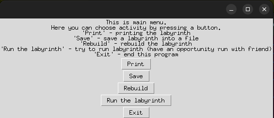
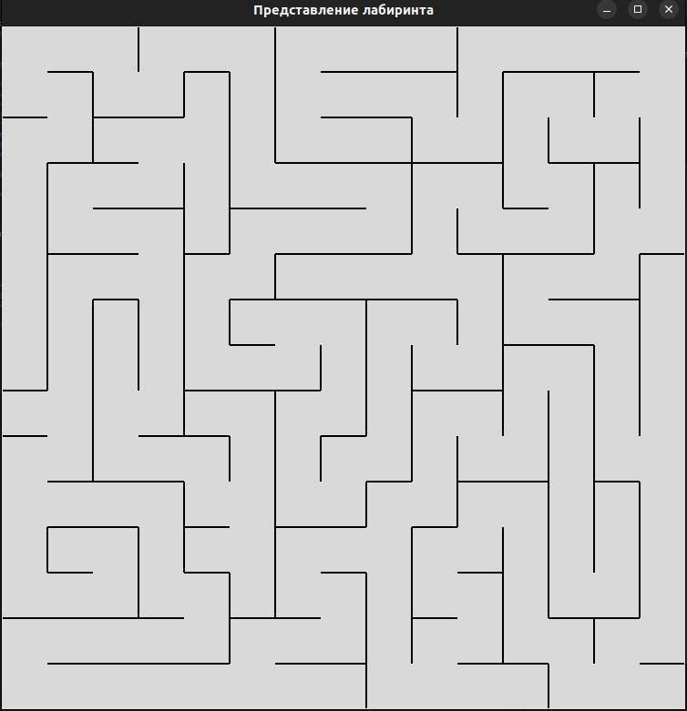
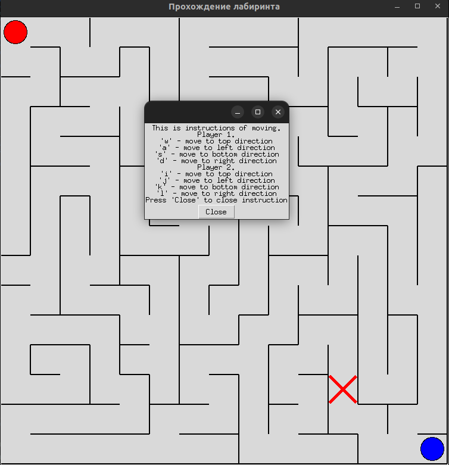
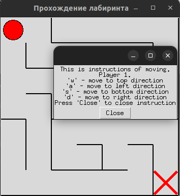

# Проект по построению лабиринта

В данном проекте использовани следующие алгоритмы построения лабинта: поиск в глубину, минимальное остовное дерево, алгорим Алдуса-Бродера и алгорим Рассела-Болта. 
- `gen_parent.py` - содерижит класс со статическим методом разрушения стен
- `cell.py` - содержит класс клетки из которых состоит лабиринт
- `file_gen.py` - содержит класс со статическим методом постоения лабиринта из файла
- `dfs_gen.py` - содержит класс со статическим методом постоения лабиринта используя обход в глубину
- `mst_gen.py` - содержит класс со статическим методом постоения лабиринта используя алгоритм Прима для построения минимального остовного дерева
- `aldus_broder_gen.py` - содержит класс со статическим методом постоения лабиринта используя алгоритм Алдоса-Бродера
- `rassel_bolt_gen.py` - содержит класс со статическим методом постоения лабиринта используя алгоритм Рассела-Болта
- `labyrinth_map.py` - содержит класс который алицетворяет из себя наш лабиринт и содержит все необходимые для него методы
- `user_interface.py` - содержит класс с полностью готовым графическим пользовательским интерфейсом 

В данном проекте били использованы следующие модули:
- `tkinter`
- `random`

## Пример запущенной программы








## Запуск проекта

Проек представляет из себя главный класс LabyrinthMap это класс генерирует сам лабиринт и тд. Также есть класс LabyrinthUser это UI для совершения неоходимых запросов и через main.py мы и сповершаем запросы. Также в данном проекте предоставлени файлы lab.txt, lab1.txt, lab2.txt это примеры как выглядят визуально лабиринт.

После клонирования репозитория необходимо зайти в директорию

 ```cd py_project``` 

дальше запустить `main.py` 

```python3 main.py```.

